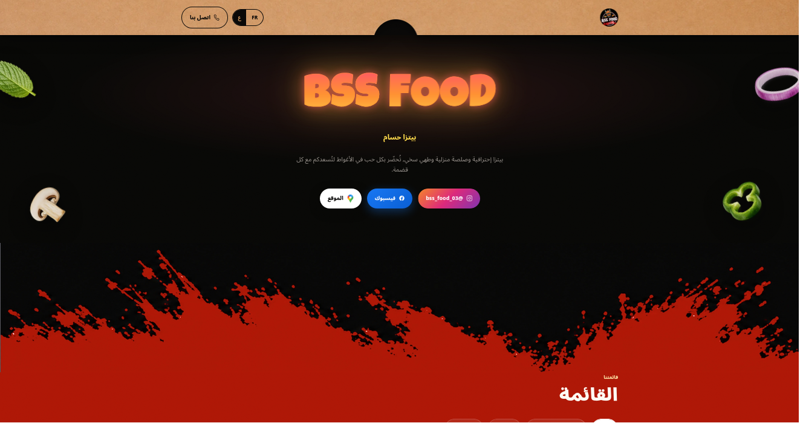
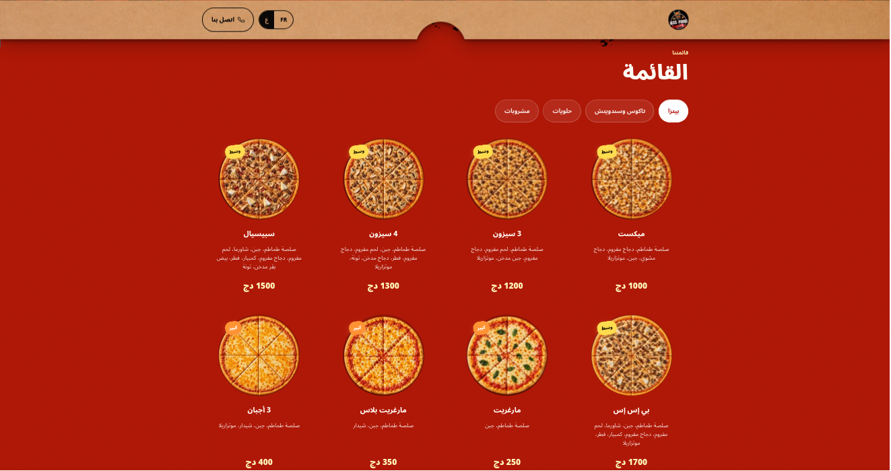
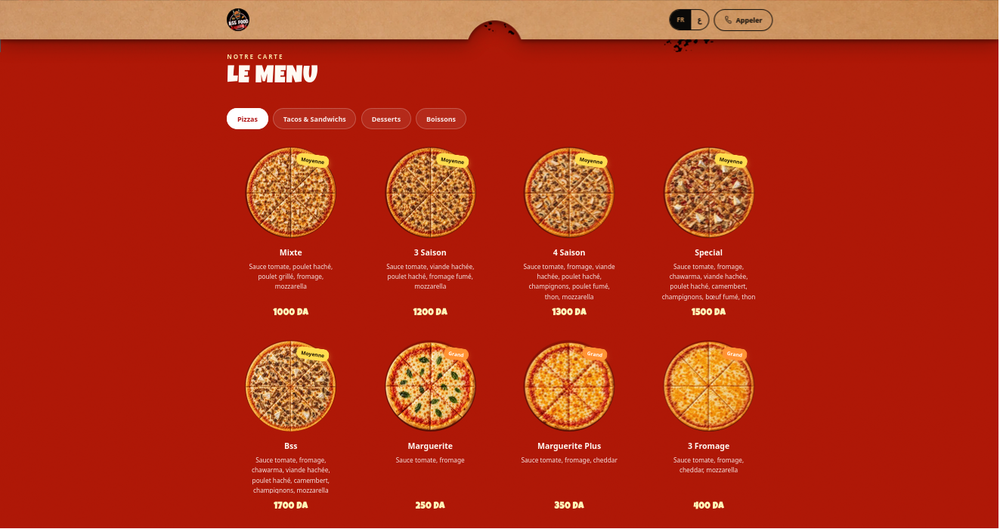
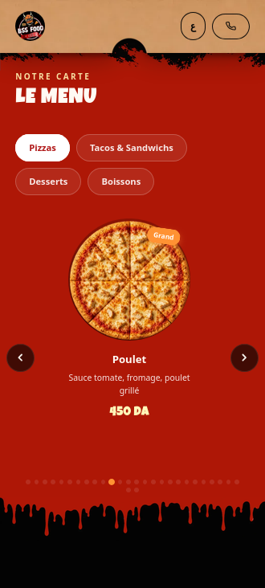
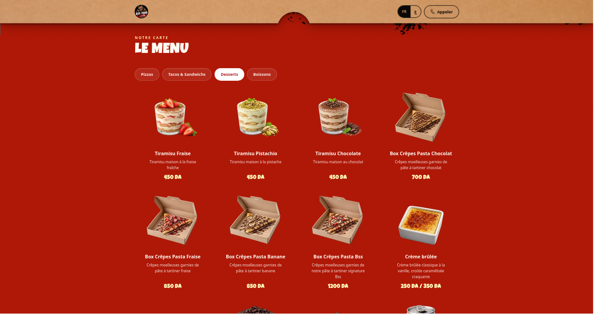
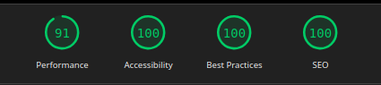

# BSS FOOD

BSS FOOD is a bilingual (Arabic / French) restaurant ordering website built for a local pizzeria (Pizza Houssam) in Laghouat, focused on fast load times and a clean, mobile-first ordering experience.

## Overview

The site presents the restaurant's full menu (pizza, tacos, sandwiches, drinks, desserts) with pricing, and routes customers to WhatsApp/Instagram for ordering and delivery — no backend or payment integration required.

It provides:

- Full bilingual menu (Arabic default, French toggle) with RTL layout
- Category-based menu filtering (Pizza, Tacos & Sandwiches, Drinks, Desserts)
- Direct-to-order links (phone, Instagram, Google Maps location)
- Fully responsive, mobile-first layout
- Performance-optimized image delivery (WebP, lazy loading)

## Tech Stack

- HTML5 / CSS3 (custom, no framework)
- Vanilla JavaScript (menu filtering, language toggle)
- Python (build/image-optimization script — WebP conversion)
- Hosted on Netlify, custom domain via Namecheap

## Performance

- Lighthouse score: 91 Performance / 100 Accessibility / 100 Best Practices / 100 SEO (tested live, mobile, slow 4G throttling)
- All menu images converted to WebP, properly sized via srcset, and lazy-loaded
- No external font/JS bloat — kept dependency-free for speed

## Screenshots

### Hero Section

### Menu — Arabic (RTL)

### Menu — French

### Mobile View

### Category Filter in Action

### Lighthouse Audit

## Repository Structure

- `index.html` — main page markup
- `app.js` — menu filtering, language toggle, interactivity
- `images/` — menu photography and UI assets (WebP)
- `fonts/` — custom typography

## Intellectual Property

Copyright (c) 2026 Abdelrahman Benmoulai. All rights reserved.

This repository is published for portfolio and demonstration purposes only. No permission is granted to copy, reuse, modify, redistribute or republish the design, code, or content without prior written authorization from the author.
